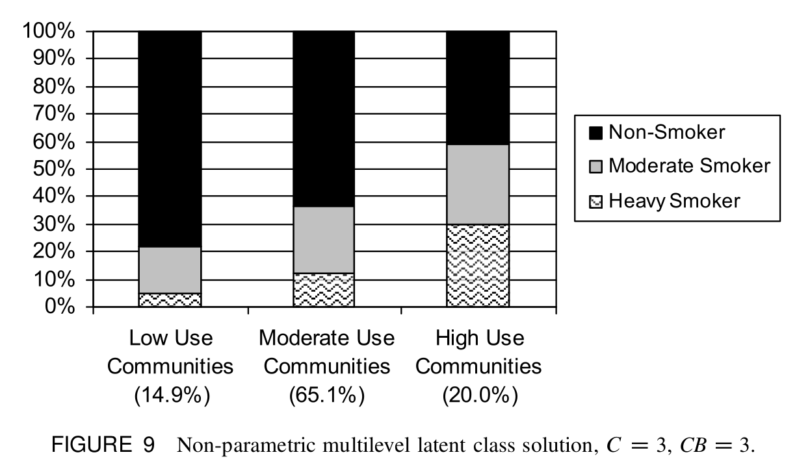

# What was not correct before?

When I am trying to write down the statistical details of multilevel LCA in `PROC LCA`, I found an important information that actually make me feel all the analyses about mixed effect LCA [we have been conducting previously](http://rpubs.com/winterwang/MixedLCA) were somehow misleading. 

In the [`PROC LCA` user's guideline (https://methodology.psu.edu/sites/default/files/software/proclcalta/proc_lca_lta_1-3-2-1_users_guide.pdf)](https://methodology.psu.edu/sites/default/files/software/proclcalta/proc_lca_lta_1-3-2-1_users_guide.pdf), if you go to Page 10, last sentence of the top paragraph. It says **"Clustering is ignored for estimation purposes, but is taken into account in calculating standard errors by using a 'robust' or 'sandwich' style covariance estimate."** Which contradicts with what was described in page 21 about the function of `CLUSTER` option: **"This statement tells `PROC LCA` that the subjects are not independent random draws, but are nested within clusters such as schools or classrooms..."** 

Therefore, I ran two SAS `PROC LCA` programmes (one with the `CLUSTER ID` option, one without) and compared the outputs from the two programmes. If the data structure was considered properly, the two programmes should have given me two different estimates. However, it turned out that **they produced identical parameter estimates**. This meant that the clustered data structure was ignored in `SAS`, even if we used the `CLUSTER ID` statement, the observations were considered as independent in the previous calculations. I was really disappointed, and sincerely sorry about that. But they were not in vain, because when digging into the methodology, conducting LCA by ingoring the data structure should be the first step when someone perform a Multilevel LCA.

# What should I have done? 

According to a multilevel LCA (MLCA) example paper: [Multilevel latent class analysis: An application of adolescent smoking typologies with individual and contextual predictors](https://www.tandfonline.com/doi/abs/10.1080/10705511003659342): 

**"MLCA accounts for the nested structure of the data by allowing latent class intercepts to vary across Level 2 units and thereby examining if and how Level 2 units influence the Level 1 latent classes. These random intercepts allow the probability of membership in a particular Level 1 latent class to vary across Level 2 units (e.g., communities)."**

In their article, they wanted to identify the smoking pattern for individuals while the individuals were nested within the communities. So they applied MLCA to identify smoking pattern for their study sample, and then within the MLCA framework, communities were also classified by the patterns of smokers within the community:




This gave me an idea of "how to deal with the non-consistent eaters problem" that we were concerning about. Because we don't need to. A proper MLCA does it for us. 

In MLCA, separate latent class models are specified for level 1 (in NDNS data, the observations) and level 2 (in NDNS data, the individuals). So our data from NDNS actually provided valuable data about how adults in the UK eat throughout the day for 4 days. We can use the data to capture the carbohydrates (or whatever else we are interested) eating time patterns from these observations, and then based on the carb eating patterns calculated by the model, people that eated similar across four days should be regrouped. So there should be two-steps of regrouping. 

# An example that examined 3 level 1 classes and 2 level 2 classes in the NDNS data

I have done a MLCA that specified 3 latent classes in level 1 (observations) and two latent classes in level 2 (individuals) using Mplus 7.4, and the summary of analysis as well as the results are shown below: 

1. In this analysis, carbohydrates intake was defined as: 
    - not eating; 
    - eating and carbohydrates contributed less than 50% of energy;
    - eating and carbohydrates contributed higher or equal to 50% of energy.
    
2. Level 1 latent classes are called **within classes (CW)**, level 2 latent classes are called **between classes (CB)**; 

3. Univariate proportions and counts for the responses about carborhydrates consumption: (Note that H0-H23 indicate the hour of the day)

```
UNIVARIATE PROPORTIONS AND COUNTS FOR CATEGORICAL VARIABLES

    H0            proportion        counts
         Not eating    0.974        23838.000
       < 50% energy    0.015          364.000
      >= 50% energy    0.011          281.000
    H1
         Not eating    0.988        24190.000
       < 50% energy    0.006          150.000
      >= 50% energy    0.006          143.000
    H2
         Not eating    0.992        24295.000
       < 50% energy    0.004           89.000
      >= 50% energy    0.004           99.000
    H3
         Not eating    0.993        24315.000
       < 50% energy    0.003           77.000
      >= 50% energy    0.004           91.000
    H4
         Not eating    0.992        24284.000
       < 50% energy    0.003           73.000
      >= 50% energy    0.005          126.000
    H5
         Not eating    0.986        24143.000
       < 50% energy    0.005          125.000
      >= 50% energy    0.009          215.000
    H6
         Not eating    0.869        21265.000
       < 50% energy    0.051         1253.000
      >= 50% energy    0.080         1965.000
    H7
         Not eating    0.678        16599.000
       < 50% energy    0.095         2315.000
      >= 50% energy    0.227         5569.000
    H8
         Not eating    0.623        15248.000
       < 50% energy    0.118         2881.000
      >= 50% energy    0.260         6354.000
    H9
         Not eating    0.660        16149.000
       < 50% energy    0.117         2872.000
      >= 50% energy    0.223         5462.000
    H10
         Not eating    0.630        15428.000
       < 50% energy    0.154         3769.000
      >= 50% energy    0.216         5286.000
    H11
         Not eating    0.723        17706.000
       < 50% energy    0.121         2952.000
      >= 50% energy    0.156         3825.000
    H12
         Not eating    0.600        14683.000
       < 50% energy    0.222         5431.000
      >= 50% energy    0.178         4369.000
    H13
         Not eating    0.501        12262.000
       < 50% energy    0.277         6778.000
      >= 50% energy    0.222         5443.000
    H14
         Not eating    0.738        18061.000
       < 50% energy    0.129         3163.000
      >= 50% energy    0.133         3259.000
    H15
         Not eating    0.676        16548.000
       < 50% energy    0.144         3527.000
      >= 50% energy    0.180         4408.000
    H16
         Not eating    0.696        17045.000
       < 50% energy    0.146         3581.000
      >= 50% energy    0.158         3857.000
    H17
         Not eating    0.685        16779.000
       < 50% energy    0.189         4638.000
      >= 50% energy    0.125         3066.000
    H18
         Not eating    0.577        14134.000
       < 50% energy    0.276         6750.000
      >= 50% energy    0.147         3599.000
    H19
         Not eating    0.621        15207.000
       < 50% energy    0.242         5913.000
      >= 50% energy    0.137         3363.000
    H20
         Not eating    0.619        15144.000
       < 50% energy    0.227         5546.000
      >= 50% energy    0.155         3793.000
    H21
         Not eating    0.641        15690.000
       < 50% energy    0.199         4871.000
      >= 50% energy    0.160         3922.000
    H22
         Not eating    0.752        18403.000
       < 50% energy    0.132         3242.000
      >= 50% energy    0.116         2838.000
    H23
         Not eating    0.921        22548.000
       < 50% energy    0.043         1062.000
      >= 50% energy    0.036          873.000
```

4. Model defines 3 latent classes in level 1, and 2 latent classes in level 2, the distribution and proportion from the model are:

```
FINAL CLASS COUNTS AND PROPORTIONS FOR THE LATENT CLASS PATTERNS
BASED ON THEIR MOST LIKELY LATENT CLASS PATTERN

Class Counts and Proportions

  Latent Class
    Pattern
                    count       proportion
    1  1             4658          0.19025
    1  2             4190          0.17114
    1  3             6037          0.24658
    2  1              473          0.01932
    2  2             4761          0.19446
    2  3             4364          0.17825


FINAL CLASS COUNTS AND PROPORTIONS FOR EACH LATENT CLASS VARIABLE
BASED ON THEIR MOST LIKELY LATENT CLASS PATTERN

  Latent Class
    Variable    Class
                               count       proportion
    CB             1           14885          0.60797
                   2            9598          0.39203
    CW             1            5131          0.20957
                   2            8951          0.36560
                   3           10401          0.42483
```

## Visualisation of level 1 latent classes (CW)

```{r message=FALSE, warning=FALSE, include=FALSE, paged.print=FALSE}
library(RColorBrewer)
library(plyr)
library(tidyverse)
library(dplyr)
library(epiDisplay)
library(scales)
library(readr)
CW3CB2_50 <- read_table2("50NDNS_CW3CB2.txt",
                         col_names = FALSE)

names(CW3CB2_50) <- c("H0",
                      "H1",
                      "H2",
                      "H3",
                      "H4",
                      "H5",
                      "H6",
                      "H7",
                      "H8",
                      "H9",
                      "H10",
                      "H11",
                      "H12",
                      "H13",
                      "H14",
                      "H15",
                      "H16",
                      "H17",
                      "H18",
                      "H19",
                      "H20",
                      "H21",
                      "H22",
                      "H23",
                      "ID_DAY",
                      "AGE",
                      "SEX",
                      "CPROB1",
                      "CPROB2",
                      "CPROB3",
                      "CPROB4",
                      "CPROB5",
                      "CPROB6",
                      "CB",
                      "CW",
                      "MLCJOINT",
                      "ID")

pp <- CW3CB2_50 %>% 
  group_by(CW) %>% 
  summarise(H0_1 = sum(H0 == 1)/length(H0), 
            H0_2 = sum(H0 == 2)/length(H0),
            H1_1 = sum(H1 == 1)/length(H1), 
            H1_2 = sum(H1 == 2)/length(H1),
            H2_1 = sum(H2 == 1)/length(H2), 
            H2_2 = sum(H2 == 2)/length(H2),
            H3_1 = sum(H3 == 1)/length(H3), 
            H3_2 = sum(H3 == 2)/length(H3),
            H4_1 = sum(H4 == 1)/length(H4), 
            H4_2 = sum(H4 == 2)/length(H4),
            H5_1 = sum(H5 == 1)/length(H5), 
            H5_2 = sum(H5 == 2)/length(H5),
            H6_1 = sum(H6 == 1)/length(H6), 
            H6_2 = sum(H6 == 2)/length(H6),
            H7_1 = sum(H7 == 1)/length(H7), 
            H7_2 = sum(H7 == 2)/length(H7),
            H8_1 = sum(H8 == 1)/length(H8), 
            H8_2 = sum(H8 == 2)/length(H8),
            H9_1 = sum(H9 == 1)/length(H9), 
            H9_2 = sum(H9 == 2)/length(H9),
            H10_1 = sum(H10 == 1)/length(H10), 
            H10_2 = sum(H10 == 2)/length(H10),
            H11_1 = sum(H11 == 1)/length(H11), 
            H11_2 = sum(H11 == 2)/length(H11),
            H12_1 = sum(H12 == 1)/length(H12), 
            H12_2 = sum(H12 == 2)/length(H12),
            H13_1 = sum(H13 == 1)/length(H13), 
            H13_2 = sum(H13 == 2)/length(H13),
            H14_1 = sum(H14 == 1)/length(H14), 
            H14_2 = sum(H14 == 2)/length(H14),
            H15_1 = sum(H15 == 1)/length(H15), 
            H15_2 = sum(H15 == 2)/length(H15),
            H16_1 = sum(H16 == 1)/length(H16), 
            H16_2 = sum(H16 == 2)/length(H16),
            H17_1 = sum(H17 == 1)/length(H17), 
            H17_2 = sum(H17 == 2)/length(H17),
            H18_1 = sum(H18 == 1)/length(H18), 
            H18_2 = sum(H18 == 2)/length(H18),
            H19_1 = sum(H19 == 1)/length(H19), 
            H19_2 = sum(H19 == 2)/length(H19),
            H20_1 = sum(H20 == 1)/length(H20), 
            H20_2 = sum(H20 == 2)/length(H20),
            H21_1 = sum(H21 == 1)/length(H21), 
            H21_2 = sum(H21 == 2)/length(H21),
            H22_1 = sum(H22 == 1)/length(H22), 
            H22_2 = sum(H22 == 2)/length(H22),
            H23_1 = sum(H23 == 1)/length(H23), 
            H23_2 = sum(H23 == 2)/length(H23))


pp_long <- pp %>% 
  gather(Hour, Prob, -CW) %>% 
  separate(Hour, into = c("HourN", "Carbo"), sep = "_") 


pp_long$HourN <- factor(pp_long$HourN, levels = c("H0","H1" ,"H2", "H3", "H4", "H5", "H6", "H7", "H8", "H9", "H10","H11","H12","H13","H14","H15","H16","H17","H18","H19","H20","H21","H22","H23"))
```


```{r echo=FALSE, fig.height=5, fig.width=14, message=FALSE, warning=FALSE, cache=TRUE}
library(ggthemr)
ggthemr("fresh", layout = "scientific")
library(ggplot2)


ggplot(pp_long[pp_long$CW == 1, ], aes(y = Prob, x=HourN, group = Carbo, color = Carbo)) + 
  geom_point(size = 3) + 
  geom_line(size = 1.5) + 
  theme(axis.title = element_text(size = 18), 
        axis.text = element_text(size = 18), 
        axis.line = element_line(colour = "black"), 
        panel.border = element_blank(), 
        panel.background = element_blank(), 
        legend.text = element_text(size = 15), 
        legend.title = element_text(size = 15) 
        # legend.position = "bottom", 
        # legend.direction = "horizontal"
  ) + 
  labs(title = "Class 1 Big breakfast: 21.0%", x = "Hour of the day", y = "Probability",
       color = "Carbohydrate\nintake") + 
  scale_color_discrete(labels = c("< 50%", ">= 50%")) + 
  ylim(c(0,1))


ggplot(pp_long[pp_long$CW == 2, ], aes(y = Prob, x=HourN, group = Carbo, color = Carbo)) + 
  geom_point(size = 3) + 
  geom_line(size = 1.5) + 
  theme(axis.title = element_text(size = 18), 
        axis.text = element_text(size = 18), 
        axis.line = element_line(colour = "black"), 
        panel.border = element_blank(), 
        panel.background = element_blank(), 
        legend.text = element_text(size = 15), 
        legend.title = element_text(size = 15) 
        # legend.position = "bottom", 
        # legend.direction = "horizontal"
  ) + 
  labs(title = "Class 2 low-carb dinner: 36.6%", x = "Hour of the day", y = "Probability",
       color = "Carbohydrate\nintake") + 
  scale_color_discrete(labels = c("< 50%", ">= 50%")) + 
  ylim(c(0,1))


ggplot(pp_long[pp_long$CW == 3, ], aes(y = Prob, x=HourN, group = Carbo, color = Carbo)) + 
  geom_point(size = 3) + 
  geom_line(size = 1.5) + 
  theme(axis.title = element_text(size = 18), 
        axis.text = element_text(size = 18), 
        axis.line = element_line(colour = "black"), 
        panel.border = element_blank(), 
        panel.background = element_blank(), 
        legend.text = element_text(size = 15), 
        legend.title = element_text(size = 15) 
        # legend.position = "bottom", 
        # legend.direction = "horizontal"
  ) + 
  labs(title = "Class 3 late lunch late dinner low carb: 42.5%", x = "Hour of the day", y = "Probability",
       color = "Carbohydrate\nintake") + 
  scale_color_discrete(labels = c("< 50%", ">= 50%")) + 
  ylim(c(0,1))
```


## Visualisation of level 2 latent classes (CB)

```{r echo=FALSE, fig.height=6, fig.width=7, message=FALSE, warning=FALSE, cache=TRUE}

ndnsNNN <- read_csv("ndnsNNN.dat")
dt <- ndnsNNN[, c(2,5)]
names(dt) <- c("ID_DAY", "DayofWeek")

CW3CB2_50 <- CW3CB2_50 %>% 
  left_join(dt, by = "ID_DAY")


chart.data <- CW3CB2_50 %>% 
  group_by(CB, CW) %>% 
  tally %>% 
  group_by(CB) %>% 
  mutate(pct = n/sum(n))

chart.data <- ddply(chart.data, .(CB),
                     transform, pos = cumsum(pct) - (0.5 * pct))

chart.data$CW <- factor(chart.data$CW, levels = c("3", "2", "1"), 
                        labels = c("Late lunch late dinner low carb", "Low-carb dinner", "Big breakfast"))
chart.data$CB <- factor(chart.data$CB, levels = c("1", "2"), 
                        labels = c("Individual class 1\n(60.8%)",  "Individual class 2\n(39.2%)"))


library(ggthemr)
ggthemr("dust", layout = "scientific")
ggplot() + 
  geom_bar(aes(y = pct, x = CB, fill = CW), data = chart.data, width = 0.6,
           stat="identity") + 
  geom_text(data=chart.data, aes(x = CB, y = pos, label = paste0(sprintf("%1.1f", pct*100),"%")),
            size=4, colour="white", family="Atlas Grotesk Medium") + 
  theme(legend.position="bottom", legend.direction="horizontal",
        legend.title = element_blank(), 
        axis.title = element_text(size = 18), 
        axis.text = element_text(size = 18), 
        axis.line = element_line(colour = "black"), 
        plot.title=element_text(family="Atlas Grotesk Medium"),
        text=element_text(family="Atlas Grotesk Light")) + 
  labs(title = "Multilevel latent class solution", x = "Between Individual classes", y = "Percentage") +
  scale_y_continuous(labels=percent)
```

So, if what we have defined in the level 1 classes are correct then in the individual level, there are two types of people, class 1 and class 2. Individuals in class 1 have about evenly distributed probabilities of carbohydrate eating pattern, while individuals in class 2 have very low possiblity (4.9%) of eating a big breakfast.

## Latent Classes patterns estimated by the model

Where: 

- **CB**: Between individual (level 2) latent classes;
- **CW**: Observational latent classes (level 1);
- **LCpattern**: Latent Class Pattern defined as:

```  
  Latent Class         CB        CW
   Pattern No.      Class     Class

         1             1         1
         2             1         2
         3             1         3
         4             2         1
         5             2         2
         6             2         3
```

```{r echo=FALSE, cache=TRUE}
CW3CB2_50 <- CW3CB2_50[order(CW3CB2_50$ID,CW3CB2_50$ID_DAY,CW3CB2_50$CB),]
library(DT)

dt <- CW3CB2_50 %>% 
  dplyr::select(ID, DayofWeek, AGE, SEX, CB, CW, MLCJOINT) %>% 
  filter(ID < 21209611)  

names(dt)[7] <- c("LCpattern")

datatable(dt, options = list(
  searching = TRUE,
  pageLength = 8,
  lengthMenu = c(5, 10, 15, 20)))
#  %>% 
#   formatRound("CPROB1", 1) %>% 
#   formatRound("CPROB2", 1) %>% 
#   formatRound("CPROB3", 1) %>% 
#   formatRound("CPROB4", 1) %>% 
#   formatRound("CPROB5", 1) %>% 
#   formatRound("CPROB6", 1) 

```

